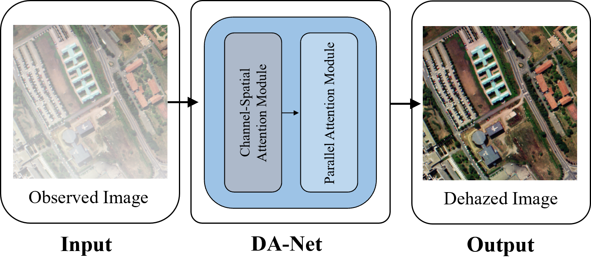
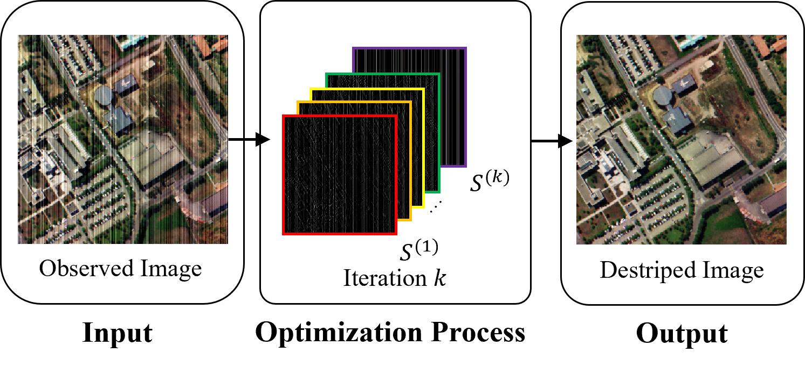
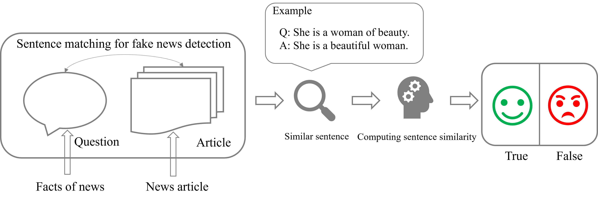

<h2>Namwon Kim</h2>

I'm currently pursuing the Ph.D. degree (advised by [ Prof. Chang-Sung Jeong ](https://koreauniv.pure.elsevier.com/en/persons/chang-sung-jeong)) in the [ Department of Electrical and Computer Engineering ](https://ee.korea.ac.kr/eng/main/main.html) at the [ Korea University](https://www.korea.edu/), Seoul, Republic of Korea.

 

My research interests include:
- Artificial Intelligence
- Computer Vision
- Distributed Parallel Computing
- Image Processing.

 

<h2>Publications</h2>
<table style="width:100%;border:0px;border-spacing:0px;border-collapse:separate;margin-right:auto;margin-left:auto;">
  <tbody>
  <!--             DA-Net-->
  <tr>
      <td style="padding:20px;width:35%;vertical-align:middle">
          
      </td>
      <td width="75%" valign="middle">
        

            <a target="_blank" href="https://ieeexplore.ieee.org/document/10679105">
                <papertitle>
                  DA-Net: Dual Attention Network for Haze Removal in Remote Sensing Image
                </papertitle>
            </a>
             
            <b>Namwon Kim*</b>, Il-Seok Choi, Seong-Soo Han, and Chang-Sung Jeong
             
            <em>IEEE Access</em>, 2024

             
            [<a target="_blank" href="https://ieeexplore.ieee.org/stamp/stamp.jsp?tp=&arnumber=10679105">paper</a>]
             
        

      </td>
  </tr>
  <!--             ADOM-->
  <tr>
      <td style="padding:20px;width:35%;vertical-align:middle">
          
      </td>
      <td width="75%" valign="middle">
        

            <a target="_blank" href="https://ieeexplore.ieee.org/document/10262317">
                <papertitle>
                  ADOM: ADMM-Based Optimization Model for Stripe Noise Removal in Remote Sensing Image
                </papertitle>
            </a>
             
            <b>Namwon Kim*</b>, Seong-Soo Han, and Chang-Sung Jeong
             
            <em>IEEE Access</em>, 2023

             
            [<a target="_blank" href="https://ieeexplore.ieee.org/stamp/stamp.jsp?tp=&arnumber=10262317">paper</a>]
            [<a target="_blank" href="https://github.com/namwonss/ADOM">code</a>]
             
        

      </td>
  </tr>
  <!--             FAMOUS-->
  <tr>
      <td style="padding:20px;width:35%;vertical-align:middle">
          
      </td>
      <td width="75%" valign="middle">
        

            <a target="_blank" href="https://ieeexplore.ieee.org/document/8663864">
                <papertitle>
                  FAMOUS: Fake News Detection Model Based on Unified Key Sentence Information
                </papertitle>
            </a>
             
            <b>Namwon Kim*</b>, Deokjin Seo, and Chang-Sung Jeong
             
            <em>2018 IEEE 9th International Conference on Software Engineering and Service Science (ICSESS)</em>, 2018

             
            [<a target="_blank" href="https://nbviewer.org/github/namwonss/namwonss.github.io/blob/master/images/famous.pdf">paper</a>]
             
        

      </td>
  </tr>

  </tbody>
</table>

 

<h2>Awards and Honors</h2>
<table style="width:100%;border:0px;border-spacing:0px;border-collapse:separate;margin-right:auto;margin-left:auto;">
    <tbody>
    <tr>
        <ul>
            <li>
                Stage 1 Winner of the Track 5, 2021 AI R&D Grand Challenge, Ministry of Science and ICT, South Korea.
                
2021

            </li>
            <li>
                5th Place Winner of the Object Classification Track, 2020 AI R&D Grand Challenge, Ministry of Science and ICT, South Korea.
                
2020

            </li>
        </ul>
    </tr>
    </tbody>
</table>
    

    

